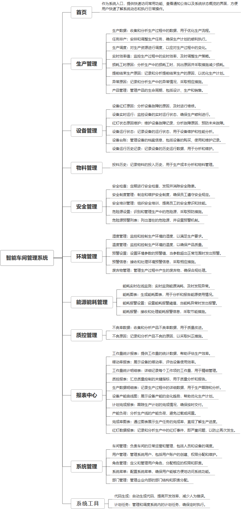

 

    
 

公司拥有上百套具有自主知识产权的软件系统，详情请查看码云首页或公司官网

 
<h1>智能车间管理平台</h1>

<a href="https://www.haishi.net.cn/">公司官网</a> ｜ <a href="https://www.haishi.net.cn/">在线体验</a>

 

## 系统介绍

智能车间管理系统是一个集成了现代信息技术与先进管理理念的综合平台，旨在通过数字化手段优化制造企业的生产管理过程。该系统涵盖了从生产计划、设备管理到质量控制等多个方面，具体功能包括但不限于：生产数据的实时监控与分析、设备的运行状态跟踪及维护、能耗与安全的预警管理、以及生产效率的评估与提升等。通过系统化的数据采集和智能化的决策支持，智能车间管理系统能够帮助企业实现生产过程的透明化、标准化和自动化，从而提高生产效率、降低成本、确保产品质量，并促进企业可持续发展。例如，系统中的“设备实时运行”模块可以实时显示车间内所有设备的工作状态，而“能耗图表”则能帮助管理者了解并优化能源使用情况，减少浪费。此外，“生产数据明细表”和“质控报表”等功能还为管理层提供了详尽的数据支持，便于进行科学决策。
智能车间管理系统是一个集成了现代信息技术与先进管理理念的综合平台，旨在通过数字化手段优化制造企业的生产管理过程。该系统涵盖了从生产计划、设备管理到质量控制等多个方面，具体功能包括但不限于：生产数据的实时监控与分析、设备的运行状态跟踪及维护、能耗与安全的预警管理、以及生产效率的评估与提升等。通过系统化的数据采集和智能化的决策支持，智能车间管理系统能够帮助企业实现生产过程的透明化、标准化和自动化，从而提高生产效率、降低成本、确保产品质量，并促进企业可持续发展。例如，系统中的“设备实时运行”模块可以实时显示车间内所有设备的工作状态，而“能耗图表”则能帮助管理者了解并优化能源使用情况，减少浪费。此外，“生产数据明细表”和“质控报表”等功能还为管理层提供了详尽的数据支持，便于进行科学决策。
本项目名称为服装智能制造软件平台，旨在通过数字化手段提升服装制造企业的生产效率、质量和管理水平。该平台涵盖了从生产计划、任务排产、设备管理到物料管理、质量控制、安全管理、环境管理以及能源能耗管理等各个环节，实现了生产全流程的数字化管控。该系统提供实时数据监控、预警机制以及报表分析功能，帮助企业及时发现问题、优化生产流程、降低成本，最终提升企业竞争力。
本项目主要面向服装制造企业内部使用，包含管理端和数据大屏展示端：
- 管理端：供企业管理人员使用，可以进行生产管理、设备管理、物料管理、安全管理、环境管理、能源管理、质量管理等操作，以及查看报表数据。
- 数据大屏展示端：用于实时展示生产数据、设备运行状态、能源消耗等关键信息，方便管理层直观了解生产情况。
                

## 系统功能介绍

### 系统包含终端说明

管理端（WEB）、数据大屏（大屏端）

| 序号 | 模块 | 模块说明 |
| --- | --- | --- |
| 1 | GC-ZNCJ-HH-SERVER | 服务端 |
| 2 | GC-ZNCJ-HH-FRONT | 前端合集 |
| 3 | GC-ZNCJ-HH-BI | 未知类型 |

### 系统功能结构

### 系统功能说明

主要功能：
1. 生产管理：涵盖生产数据、任务排产、生产调度、实时效率值、损耗工时原因分析、提前结束生产原因分析、异常原因分析以及产品管理等功能，实现对生产过程的精细化管理。
2. 设备管理：包括设备实时运行监控、红灯状态原因维护、设备运行状态管理、设备红灯原因记录、设备台账管理以及设备运行历史记录查询等功能，实现对设备的全面管理和维护。
3. 物料管理：提供投料历史记录查询功能，方便追踪物料使用情况。
4. 质量控制：提供不良原因分析和不良率数据统计功能，帮助企业提升产品质量。
5. 安全管理：涵盖安全检查、安全制度管理、安全培训管理、危险源设置以及危险源预警列表等功能，保障生产安全。
6. 环境管理：包括湿度管理、温度管理、预警设置、预警信息以及废弃物管理等功能，实现对生产环境的监控和管理。
7. 能源能耗管理：提供能耗实时在线监测、能耗图表展示、能耗报警设置以及能耗报警信息等功能，帮助企业节能降耗。
8. 报表中心：提供各种报表，例如工作量统计明细表、工作量统计报表、稼动率报表、质控报表、生产数据明细表、设备产能曲线图、计划完成报表、产能负荷、完成率图表以及红灯数据报表等，方便企业进行数据分析和决策。

## 系统主要界面

## 系统技术说明

### 代码模块说明

| 序号 | 目录 | 目录说明 |
| --- | --- | --- |
| 1 | GC-ZNCJ-HH-SERVER/.idea | -- |
| 2 | GC-ZNCJ-HH-SERVER/src | -- |

### 系统技术选型

#### 开发语言/框架

JAVA（JDK1.8）
前端框架：VUE2
框架：SpringBoot2.x

#### 服务中间件

Tomcat
Nginx

#### 数据库

MySQL（5.7+）
Redis

#### 其他说明

无

## 系统演示/商用

请扫码添加客服微信获取演示地址和系统详细资料。

如果您想基于智能车间管理平台进行商业化交付或定制开发服务，我们提供有偿的技术服务支持，合作模式不限，欢迎沟通！

公司官网地址： <a href="https://www.haishi.net.cn/">https://www.haishi.net.cn</a>

联系客服获取专业回答。

## 使用须知

1、 本项目商用必须获得版权所有者的授权。

2、 未经允许本项目代码不允许二次出售。

